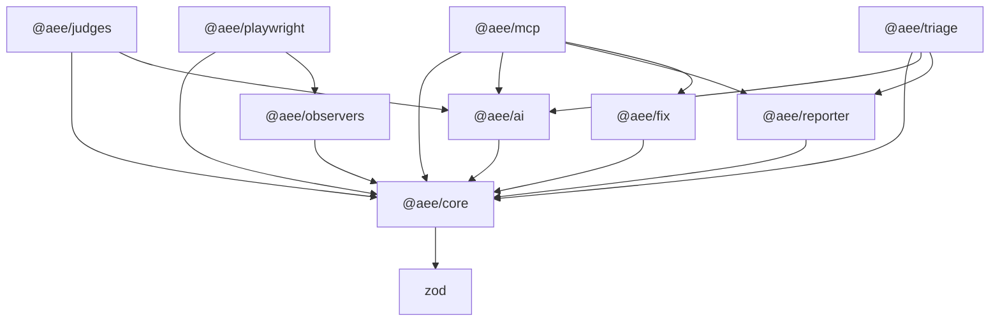

# Dependency graph

The package graph **encodes AEE's core invariants** — they hold by construction, not by discipline.

## Invariants enforced by the graph

- **`@aee/core` depends only on `zod`.** Contracts and schemas, nothing else.
- **`@aee/ai` reaches `@aee/core` and a model SDK — never a driver.** The AI layer can read captured `EvidenceRecord`s but has no dependency path to `@aee/playwright`, `@aee/observers`, or the live page. This makes "AI sees evidence only, never the live page" a structural guarantee — every conversational/agentic surface inherits it because they all go through `@aee/ai`.
- **`@aee/judges` cannot import a driver.** Judges combine an axe-core floor with an AI judgment; they never observe reality directly.
- **`@aee/playwright` is the DX/driver layer.** It depends on `@aee/core` and `@aee/observers` only — never on `@aee/judges` or `@aee/ai`. The end-to-end walking-skeleton test (`tests/walking-skeleton.test.js`) wires capture to a judge at the workspace-root level (a dev dependency), so the driver layer never couples to judging.

A `tests/graph-guard.test.js` check asserts `@aee/ai` depends on `@aee/core` but never on `@aee/playwright` or `@aee/observers`, failing CI if that boundary is ever crossed.
